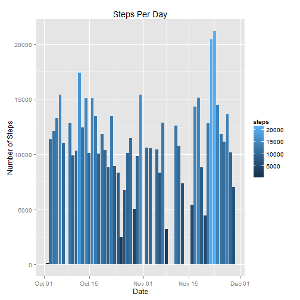
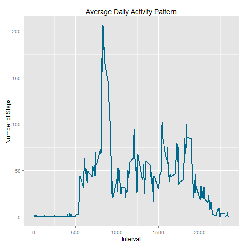
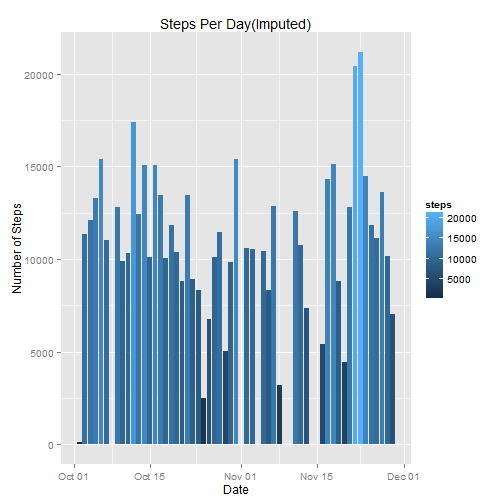
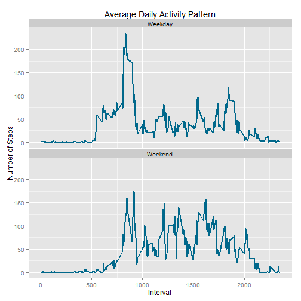

---
title: "Reproducible Research Peer Assignment 1"
author: "Anudeep Singh"
date: "Saturday, August 16, 2014"
output: html_document
---  

###Introduction   
This assignment make use of data from a personal activity monitoring device.The device collects This device collects data at 5 minute intervals through out the day. The data consists of two months of data from an anonymous individual collected during the months of October and November, 2012 and include the number of steps taken in 5 minute intervals each day.  
  
###Data  
- Dataset: [Activity monitoring data](https://d396qusza40orc.cloudfront.net/repdata%2Fdata%2Factivity.zip)  
  
###Assignment  
  
####Loading and preprocessing the data  
  
1. Load the data (i.e. read.csv())
2. Process/transform the data (if necessary) into a format suitable for your analysis


```r
data <- read.csv('activity.csv', header = TRUE, colClasses = c("numeric", "character", "numeric"))
data$date <- as.Date(data$date)
summary(data)
```

```
##      steps            date               interval   
##  Min.   :  0.0   Min.   :2012-10-01   Min.   :   0  
##  1st Qu.:  0.0   1st Qu.:2012-10-16   1st Qu.: 589  
##  Median :  0.0   Median :2012-10-31   Median :1178  
##  Mean   : 37.4   Mean   :2012-10-31   Mean   :1178  
##  3rd Qu.: 12.0   3rd Qu.:2012-11-15   3rd Qu.:1766  
##  Max.   :806.0   Max.   :2012-11-30   Max.   :2355  
##  NA's   :2304
```

####What is mean total number of steps taken per day? 
1. Ignore the missing values in the dataset.
2. Make a histogram of the total number of steps taken each day.
3. Calculate and report the mean and median total number of steps taken per day.


```r
library(ggplot2)
data2 <- na.omit(data)
date_steps <- aggregate(steps ~ date, data, sum)
summary(date_steps)
```

```
##       date                steps      
##  Min.   :2012-10-02   Min.   :   41  
##  1st Qu.:2012-10-16   1st Qu.: 8841  
##  Median :2012-10-29   Median :10765  
##  Mean   :2012-10-30   Mean   :10766  
##  3rd Qu.:2012-11-16   3rd Qu.:13294  
##  Max.   :2012-11-29   Max.   :21194
```

```r
ggplot(date_steps, aes(x=date, y=steps)) + 
      geom_histogram(stat="identity", position="identity", binwidth=nrow(date_steps), aes(fill=steps,)) +
      labs(title = "Steps Per Day", x = "Date", y = "Number of Steps")
```

 

```r
# Mean
mean(date_steps$steps)
```

```
## [1] 10766
```

```r
#Median
median(date_steps$steps)
```

```
## [1] 10765
```
  
  
####What is the average daily activity pattern?
1. Make a time series plot (i.e. type = "l") of the 5-minute interval (x-axis) and the average number of steps taken, averaged across all days (y-axis)
2. Which 5-minute interval, on average across all the days in the dataset, contains the maximum number of steps?


```r
interval_steps <- aggregate(steps ~ interval, data2, mean)
summary(interval_steps)
```

```
##     interval        steps       
##  Min.   :   0   Min.   :  0.00  
##  1st Qu.: 589   1st Qu.:  2.49  
##  Median :1178   Median : 34.11  
##  Mean   :1178   Mean   : 37.38  
##  3rd Qu.:1766   3rd Qu.: 52.83  
##  Max.   :2355   Max.   :206.17
```

```r
ggplot(interval_steps, aes(x = interval, y = steps)) + 
       geom_line(color = "deepskyblue4", size = 1) +
       labs(title = "Average Daily Activity Pattern", x = "Interval", y = "Number of Steps")
```

 

```r
#Interval with max average number of steps
interval_steps[which.max(interval_steps$steps),]
```

```
##     interval steps
## 104      835 206.2
```
  
  
####Imputing missing values
1. Calculate and report the total number of missing values in the dataset (i.e. the total number of rows with NAs)
2. Devise a strategy for filling in all of the missing values in the dataset. The strategy does not need to be sophisticated. For example, you could use the mean/median for that day, or the mean for that 5-minute interval, etc.
3. Create a new dataset that is equal to the original dataset but with the missing data filled in.
4. Make a histogram of the total number of steps taken each day and Calculate and report the mean and median total number of steps taken per day. Do these values differ from the estimates from the first part of the assignment? What is the impact of imputing missing data on the estimates of the total daily number of steps?


```r
dataNA <- data[!complete.cases(data),]
nrow(dataNA)
```

```
## [1] 2304
```
    
For imputation, we replace the NA by the mean value of 5 min interval.
  

```r
for(i in 1:nrow(data)){
  if(is.na(data$steps[i])){
    intervalValue <- data$interval[i]
    stepsValue <- interval_steps[interval_steps$interval == intervalValue,]$steps
    data$step[i] <- stepsValue

  }
}
date_steps_complete <- aggregate(steps ~ date, data, sum)
summary(date_steps_complete)
```

```
##       date                steps      
##  Min.   :2012-10-02   Min.   :   41  
##  1st Qu.:2012-10-16   1st Qu.: 8841  
##  Median :2012-10-29   Median :10765  
##  Mean   :2012-10-30   Mean   :10766  
##  3rd Qu.:2012-11-16   3rd Qu.:13294  
##  Max.   :2012-11-29   Max.   :21194
```

```r
ggplot(date_steps_complete, aes(x=date, y=steps)) + 
      geom_histogram(stat="identity", position="identity", binwidth=nrow(date_steps_complete), aes(fill=steps,)) +
      labs(title = "Steps Per Day(Imputed)", x = "Date", y = "Number of Steps")
```

 

```r
# Mean
mean(date_steps_complete$steps)
```

```
## [1] 10766
```

```r
#Median
median(date_steps_complete$steps)
```

```
## [1] 10765
```

So imputation has almost no effect on mean and median.

####Are there differences in activity patterns between weekdays and weekends?
1. Create a new factor variable in the dataset with two levels - "weekday" and "weekend" indicating whether a given date is a weekday or weekend day.
2. Make a panel plot containing a time series plot (i.e. type = "l") of the 5-minute interval (x-axis) and the average number of steps taken, averaged across all weekday days or weekend days (y-axis).


```r
data$day <- weekdays(data$date)
data$dayType <- c("Weekday")
for(i in 1:nrow(data)){
  if (data$day[i] == "Saturday" || data$day[i] == "Sunday"){
    data$dayType[i] <- "Weekend"
  }
}
weekdays_interval_steps <- aggregate(steps ~ interval+dayType, data, mean)

ggplot(weekdays_interval_steps, aes(x = interval, y = steps)) + 
       geom_line(color = "deepskyblue4", size = 1) +
       facet_wrap(~ dayType, nrow=2, ncol=1) +
       labs(title = "Average Daily Activity Pattern", x = "Interval", y = "Number of Steps")
```

 
   
   
Graph shows that there are more number of peeks during the weekends, so activity distribution all over the day. During the weekdays the most activity is during the morning hours.
